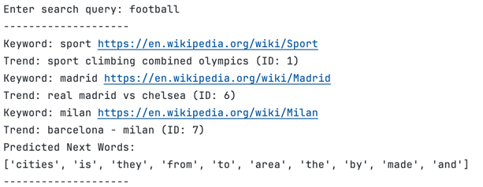

# Wikipedia and Trend Search Algorithm

## Overview
This project focuses on creating a bridge between what's trending on Google Trends and the relevant information needed
to understand those trends. It uses a mix of web scraping, APIs, natural language processing, and machine learning to
provide the user with relevant results.

## How it Works:
1. **Fetching Google Trends with Selenium**:\
    The program checks if the local database needs to be updated with latest trends (it will update if it's been more than 5 days
    since the last fetch). If an update is necessary, the program uses Selenium to fetch the first 50 results.
2. **Wikipedia Search and Data Collection**: \
    For any new trends found, the program breaks the title of the trend into its keywords, which are then searched for on
    Wikipedia using an APi call. The article text, title, and URL are stored in the database to prevent repeated API
    calls. The keyword is also associated with the specific trend, which is helpful for the Search Execution step.
3. **Training a Word2Vec Model**: \
   The text data from the result is passed to a Word2Vec model to understand and capture the relationships between
   words which will be used to predict the user's next word in their query.
4. **Search Execution**: \
    When a user inputs a query, the program searches for related trends by looking for the query and similar words
    within all the data collected in step 2. If a match is found, the keyword's associated trends are returned.

## Example
Since the 2024 Olympics are trending, if a user searches for 'football', the model would search for 'football', 'soccer'
and related words like 'sports' or specific sports teams. The resulting articles would appear as shown below. \

## Future Implementations
Currently, the program's Word2Vec model is trained on data received from the Wikipedia API calls, but the data
received can be incomplete. Even if there is a full Wikipedia article online, the API doesn't return the entire page. This
creates a limitation for the model, as it can't develop strong connections between words, which hinders the program's
ability to serve users the most relevant results. A way to overcome this issue would be to use one of Wikipedia's
massive database files, which includes the full text to all articles. If loaded and queried correctly, this could result
in a significant performance boost in two areas. Firstly, there would be less latency in fetching files since everything is
local, reducing dependency on Wikipedia being online. Secondly, the model would have access to much more data, which could
drastically improve its ability to develop connections between words and concepts.